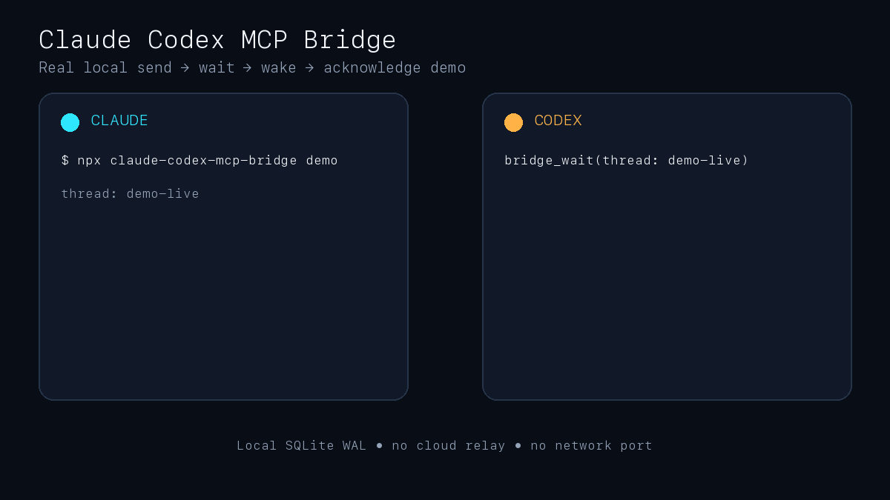

<p align="center">
  <a href="https://www.webisitystudio.co.uk/">
    
  </a>
</p>

<h1 align="center">Claude Codex MCP Bridge</h1>

<p align="center">Built by <a href="https://www.webisitystudio.co.uk/">WebiSity Studio</a></p>

[](https://github.com/WebisityStudio/claude-codex-mcp-bridge/actions/workflows/ci.yml)
[](LICENSE)

<p align="center">
  
</p>

A local MCP bridge for Claude Code and OpenAI Codex. It combines a durable SQLite mailbox with a bounded orchestration loop that can start and resume saved Codex workers.

```text
Claude Code ──stdio MCP──┐
                         ├── local SQLite WAL store
Codex       ──stdio MCP──┘
```

The default mode has no account, cloud relay, HTTP server or listening network port.

## Why

Plain MCP tools are request-response. Writing a message to a mailbox does not automatically start a new model turn in another GUI chat.

This project supports two practical patterns:

1. **Two visible chats:** both agents use `bridge_wait` before going idle. A pending MCP call returns when the matching message arrives.
2. **Claude coordinates Codex:** Claude calls `bridge_orchestrate_codex`; the bridge starts a saved Codex CLI session, waits for structured output and can resume that exact session after a Fable decision.

See [INSTRUCTIONS.md](INSTRUCTIONS.md) for copy-paste prompts.

## Features

- Local SQLite WAL mailbox
- Direct messages and broadcasts
- Stable thread IDs
- Recipient-scoped acknowledgements
- Idempotency keys
- Blocking waits with sender/thread filters
- Durable Codex run state and audit events
- Saved Codex session continuation
- Optional isolated Git worktrees
- Structured worker output
- Round and timeout limits
- Explicit safety boundaries

## Tools

| Tool | Purpose |
|---|---|
| `bridge_register` | Register an agent name and capabilities |
| `bridge_send` | Send a direct or broadcast message |
| `bridge_inbox` | Read unread messages immediately |
| `bridge_wait` | Keep the current turn open until a matching message arrives |
| `bridge_ack` | Acknowledge handled messages without deleting history |
| `bridge_thread` | Read a complete thread |
| `bridge_agents` | List registered agents |
| `ask_codex` | Handle a normal implementation, investigation or verification request without mailbox setup |
| `review_with_codex` | Run an evidence-led, read-only Codex repository review |
| `bridge_orchestrate_codex` | Start a saved Codex worker, optionally in a worktree |
| `bridge_continue_codex` | Resume the same Codex session with Claude's answer |
| `bridge_orchestration_status` | Read durable run state and audit events |

## Requirements

- Node.js 22.5 or newer
- Claude Code
- OpenAI Codex CLI
- Git, if using worktree isolation

The mailbox works anywhere Node and both MCP clients run. The automated Codex launcher uses `CODEX_BIN` when set, then the bundled Codex binary inside the macOS ChatGPT app when available, then `codex` from `PATH`.

Core tests run on macOS, Linux and Windows in GitHub Actions. The live Claude Desktop/Fable plus Codex Desktop workflow was developed and verified on macOS.

## Install

### One command

Run directly from the public GitHub repository:

```bash
npx --yes --package=github:WebisityStudio/claude-codex-mcp-bridge claude-codex-mcp-bridge setup
```

The setup command:

- builds the package automatically;
- detects and registers Claude Code and Codex;
- resolves the server's absolute path internally;
- installs the `ask-codex`, `review-with-codex` and coordinator skills;
- installs a Claude `codex-teammate` agent definition;
- points both clients at the same local database.

Open fresh Claude and Codex sessions after setup, then verify the bridge:

```bash
npx --yes --package=github:WebisityStudio/claude-codex-mcp-bridge claude-codex-mcp-bridge doctor
npx --yes --package=github:WebisityStudio/claude-codex-mcp-bridge claude-codex-mcp-bridge demo
```

Other commands:

```bash
claude-codex-mcp-bridge status
claude-codex-mcp-bridge setup --force
claude-codex-mcp-bridge uninstall
claude-codex-mcp-bridge uninstall --purge
```

`uninstall` keeps the SQLite history unless `--purge` is explicitly supplied.

### Manual fallback

```bash
git clone https://github.com/WebisityStudio/claude-codex-mcp-bridge.git
cd claude-codex-mcp-bridge
npm ci
npm run check
node dist/cli.js setup
```

If Codex is not available as `codex` on `PATH`, set `CODEX_BIN` in the MCP server environment to the full executable path.

## Everyday use

After opening a fresh Claude session:

```text
/ask-codex investigate why the authentication tests are flaky
/review-with-codex focus on authentication and tenant isolation
```

Or simply ask Claude:

```text
Ask Codex to implement this change and verify it.
Have Codex review this repository for security regressions.
```

The installed skills route these requests through `ask_codex` and `review_with_codex`. Users do not need to choose agent names, create mailbox threads or manage acknowledgements for ordinary one-shot work.

## Quick start: two visible chats

Pick one canonical thread ID, for example `invoice-review-001`. Register unique names, send with `bridge_send`, and wait with:

```json
{
  "agent": "claude-main",
  "fromAgent": "codex-main",
  "threadId": "invoice-review-001",
  "timeoutSeconds": 285,
  "acknowledge": true
}
```

Most MCP hosts cut tool calls near five minutes. The bridge caps waits at 290 seconds and defaults to 285. Agents should renew a timed-out wait while the task remains active.

A filtered wait only wakes for the exact sender and thread. Agree the thread ID before either side starts waiting.

## Quick start: autonomous Codex worker

Claude calls:

```json
{
  "coordinatorAgent": "claude-main",
  "projectPath": "/absolute/path/to/repository",
  "task": "Implement and test the bounded change",
  "threadId": "feature-x",
  "useWorktree": true,
  "maxRounds": 6
}
```

If the result is `waiting_for_fable`, Claude answers the returned question and calls `bridge_continue_codex` using the same run ID. The bridge resumes the exact Codex session and worktree.

The bridge does not commit, push, merge, deploy or clean worktrees automatically.

## Storage

The default database is:

```text
~/.local/share/claude-codex-bridge/bridge.sqlite
```

Override it in both MCP configurations with:

```text
BRIDGE_DB_PATH=/absolute/path/to/bridge.sqlite
```

All MCP processes must point to the same database.

## Honest limitations

- MCP cannot cold-wake a GUI chat after its model turn has ended. `bridge_wait` works by keeping the current call alive.
- Agent registration does not prove active processing.
- A mismatched thread filter can leave valid messages unread.
- Codex session persistence does not guarantee immediate appearance in every desktop app version's thread list.
- The default transport is local to one machine. It is not a cross-machine broker.

## Safety

- No credentials are stored by this project.
- Child processes receive a small allowlist of environment variables, not the full parent environment.
- Messages are local but are stored unencrypted in SQLite.
- Do not send secrets through the mailbox unless every connected client is trusted.
- Worker prompts prohibit commits, pushes, deployments, external sends, credential changes, deletion and production mutations unless separately approved.

## Development

```bash
npm test
npm run build
npm run check
npm audit --omit=dev --audit-level=high
```

The test suite covers mailbox routing, acknowledgements, idempotency, independent MCP processes, blocking waits, durable orchestration state, session continuation, loop limits and platform-safe process environments.

## Related work

This is not the only Claude/Codex bridge. See [docs/ALTERNATIVES.md](docs/ALTERNATIVES.md) for a comparison with Claude Channels bridges, ACP delegation tools and general agent mailboxes.

## License

MIT
